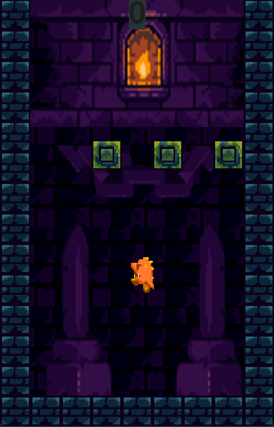

# FallingBlocks

## Description
FallingBlocks is a fun and engaging game that involves the player avoiding falling blocks. The player can move in the x-axis, while if he wants to add more dynamics to the game then he also has the option of jumping using the spacebar. What's more, the game includes moving on backgrounds which makes it even more enjoyable.
## Running the Game
### To run the FallingBlocks game, follow these steps:

Ensure that Python 3 is installed on your system. If not, download and install Python 3 from the official Python website.

##### Clone or download the FallingBlocks repository from the GitHub repository:

```shel
git clone https://github.com/Wflikeit/FallingBlocksGame.git
```

##### Install the required dependencies by running the following command:
```shel
pip install -r requirements.txt
 ```

##### Once the dependencies are installed, run the game by executing the following command:
```shel
python main.py
 ```
The FallingBlocks game window should now open, and you can start playing the game. Use the arrow keys to move the player and the spacebar to jump. Avoid the falling blocks and try to survive as long as possible!

## Tests
### To test the FallingBlocks game, follow these steps:

Ensure that Python 3 and the required dependencies are installed as mentioned in the "Running the Game" section.

##### Run the test suite by executing the following command:

```shell
pytest
```

The test suite will run and display the results in the terminal or command prompt. You should see the test cases being executed, and any failures or errors will be reported.


## License
FallingBlocks is an open-source project licensed under the [MIT License](LICENSE).
.


```shell
pip install pytest

